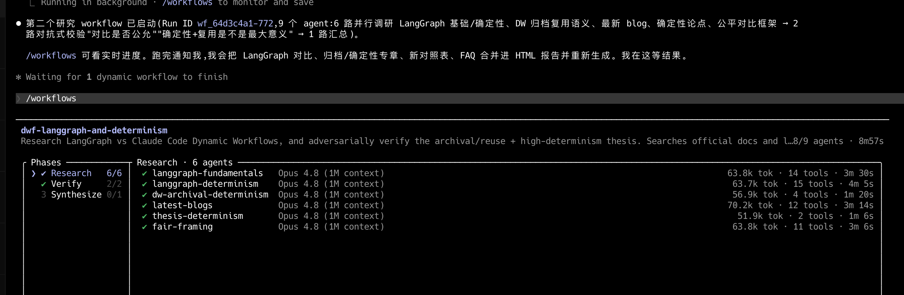

# Claude Code Dynamic Workflows 深度调研报告

> **发布日期：** 2026-05-28 · **状态：** Research Preview
> **可用平台：** Claude Code CLI / Desktop / VS Code 扩展 · Max / Team / Enterprise（需管理员启用）计划 · API (Amazon Bedrock / Vertex AI / Microsoft Foundry)

## 一句话概要

介绍Claude Code新功能——**Dynamic Workflows**的DeepResearch报告。
让Claude自主编写JS脚本调度数十到数百个subagent进行对抗式审查迭代，填补了单个subagent与自建agent team之间的能力空白。

Claude Code 新增 **Dynamic Workflows** 模式：Claude 自主编写 JS 编排脚本，在后台并发调度数十到数百个 subagent，通过对抗式审查迭代汇总结论——填补了「单个 subagent」与「自建 agent team」之间的能力空白。

## 本报告生成方式

本仓库中的 DeepResearch 报告使用 Claude Code 的 Workflow 编排模式生成，自己编排 subagent 完成调研、撰写和交叉审查，实际效果相当不错。

## 参考资料

| 资源 | 链接 |
|------|------|
| 官方公告 | [Introducing Dynamic Workflows in Claude Code](https://claude.com/blog/introducing-dynamic-workflows-in-claude-code) |
| 官方文档 | [Workflows](https://code.claude.com/docs/en/workflows) |
| Agent Teams 文档 | [Agent Teams](https://code.claude.com/docs/en/agent-teams) |
| Subagents 文档 | [Sub-agents](https://code.claude.com/docs/en/sub-agents) |
| HN 讨论（含 Bun 移植细节） | [Hacker News](https://news.ycombinator.com/item?id=48311705) |
| 第三方开源仿写 | [AgentLoom](https://github.com/vblanco20-1/AgentLoom) |
| 第三方报道 | [Pasquale Pillitteri](https://pasqualepillitteri.it/en/news/3663/claude-code-dynamic-workflows-anthropic-research-preview) |
